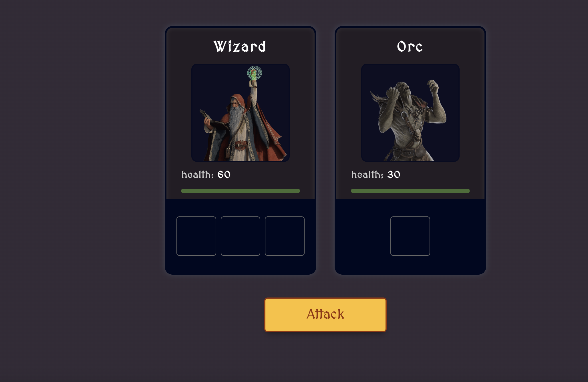

🇺🇸 [English](#english) | 🇪🇸 [Español](#español)

---

## English

# JavaScript RPG Game

🎮 **[Play the Live Demo](https://javascript-rpg.netlify.app/)**


*A simple, turn-based, browser-based fantasy role-playing game (RPG) where you play as a wizard against a series of monsters.*

## 🚀 Features

- ⚔️ **Turn-Based Combat:** Engage in classic turn-based battles.
- 🎲 **Dice Roll Mechanics:** Damage is determined by dice rolls, adding an element of chance.
- 💚 **Dynamic Health Bars:** Visually track health for both the hero and monsters.
- 👹 **Multiple Monsters:** Fight through a sequence of different monsters.
- 🏆 **Game Over Screen:** Clear victory or defeat messages at the end of the game.
- 🔧 **Modern JavaScript:** Built with ES6 Modules for organized and maintainable code.
- ⚡ **Fast Development Environment:** Uses [Vite](https://vitejs.dev/) for a quick and efficient workflow.

## 💻 Technologies Used

- **Frontend:** HTML5, CSS3, JavaScript (ES6)
- **Build Tool:** [Vite](https://vitejs.dev/)

## 🎮 How to Play

1. Open the game in your browser.
2. Click the **"Attack"** button to initiate a combat turn.
3. Both your wizard and the current monster will roll their dice.
4. The damage dealt is subtracted from the opponent's health.
5. Keep attacking until you defeat all the monsters or your wizard is vanquished!

## 🛠️ Local Installation and Execution

To run this project on your local machine:

1. **Clone the repository:**

   ```bash
   git clone <YOUR_REPOSITORY_URL>
   cd javascript-rpg
   ```
2. **Install dependencies:**

   ```bash
   npm install
   ```
3. **Start the development server:**

   ```bash
   npm start
   ```

   This will launch a local development server. Open the URL provided in your terminal (usually `http://localhost:5173`) to view the project.

## 📁 Project Structure

- `index.html`: The main entry point and page structure.
- `index.css`: Styles for all game components.
- `index.js`: The main game logic, including the game loop, attack handling, and end conditions.
- `Character.js`: A `Character` class that serves as a template for the hero and monsters.
- `data.js`: Contains the data and stats for all characters.
- `utils.js`: Utility functions for game mechanics, like dice rolls.
- `images/`: Contains the character avatar images.

---

## Español

# Juego RPG en JavaScript

🎮 **[Jugar la Demo en Vivo](https://javascript-rpg.netlify.app/)**


*Un sencillo juego de rol (RPG) de fantasía, por turnos y basado en navegador, en el que juegas como un mago contra una serie de monstruos.*

## 🚀 Características

- ⚔️ **Combate por Turnos:** Participa en batallas clásicas por turnos.
- 🎲 **Mecánica de Dados:** El daño se determina mediante tiradas de dados, añadiendo un elemento de azar.
- 💚 **Barras de Salud Dinámicas:** Sigue visualmente la salud tanto del héroe como de los monstruos.
- 👹 **Múltiples Monstruos:** Lucha a través de una secuencia de diferentes monstruos.
- 🏆 **Pantalla de Fin de Juego:** Mensajes claros de victoria o derrota al final del juego.
- 🔧 **JavaScript Moderno:** Construido con Módulos ES6 para un código organizado y mantenible.
- ⚡ **Entorno de Desarrollo Rápido:** Utiliza [Vite](https://vitejs.dev/) para un flujo de trabajo rápido y eficiente.

## 💻 Tecnologías Utilizadas

- **Frontend:** HTML5, CSS3, JavaScript (ES6)
- **Herramienta de Compilación:** [Vite](https://vitejs.dev/)

## 🎮 Cómo Jugar

1. Abre el juego en tu navegador.
2. Haz clic en el botón **"Attack"** para iniciar un turno de combate.
3. Tanto tu mago como el monstruo actual tirarán sus dados.
4. El daño infligido se resta de la salud del oponente.
5. ¡Sigue atacando hasta que derrotes a todos los monstruos o tu mago sea vencido!

## 🛠️ Instalación y Ejecución Local

Para ejecutar este proyecto en tu máquina local:

1. **Clona el repositorio:**

   ```bash
   git clone <URL_DE_TU_REPOSITORIO>
   cd javascript-rpg
   ```
2. **Instala las dependencias:**

   ```bash
   npm install
   ```
3. **Inicia el servidor de desarrollo:**

   ```bash
   npm start
   ```

   Esto iniciará un servidor de desarrollo local. Abre la URL que se muestra en tu terminal (normalmente `http://localhost:5173`) para ver el proyecto.

## 📁 Estructura del Proyecto

- `index.html`: El punto de entrada principal y la estructura de la página.
- `index.css`: Estilos para todos los componentes del juego.
- `index.js`: La lógica principal del juego, incluyendo el bucle del juego, el manejo de ataques y las condiciones de finalización.
- `Character.js`: Una clase `Character` que sirve como plantilla para el héroe y los monstruos.
- `data.js`: Contiene los datos y estadísticas de todos los personajes.
- `utils.js`: Funciones de utilidad para la mecánica del juego, como las tiradas de dados.
- `images/`: Contiene las imágenes de los avatares de los personajes.
